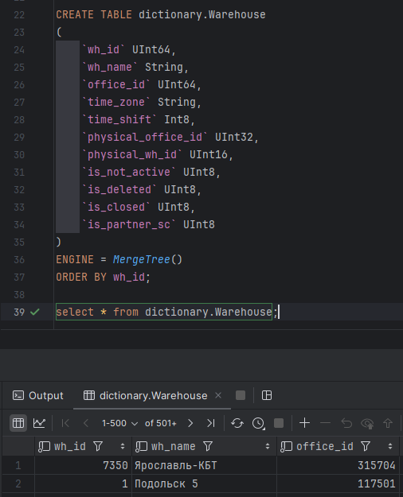
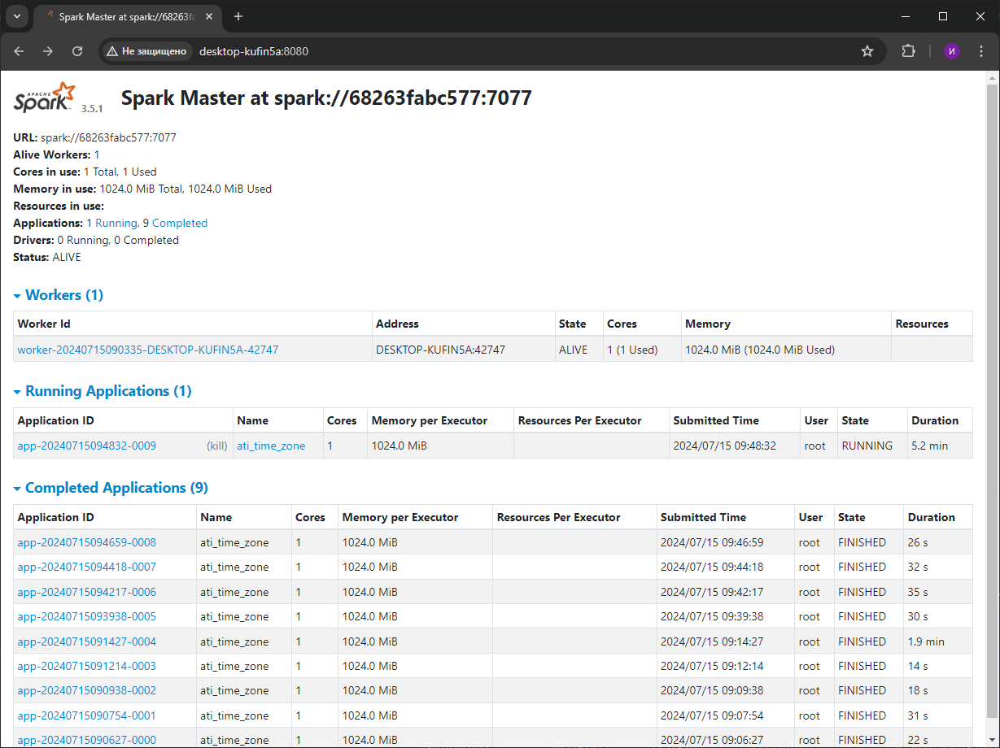

# Изучение Apache Spark + Spark Streaming

___

## Задание
1. Считать данные из вашей Кафки через спарк. Если нужно, залейте немного данных с пегас.
2. Добавить какую-нибудь колонку. Записать в ваш клик в докере. (*Можно через csv импортировать в ваш клик справочник объемов nm_id с пегаса, чтобы оттуда брать объем номенклатуры.)
3. Выложить папку с docker-compose файлами для развертывания контейнеров. Должно быть 2 файла: docker-compose.yml, .env.
4. Запушить в свой гит получившийся таск спарк. Не пушить файл с паролями.
5. Выложить в гит скрины с содержимым конечной папки в вашем клике. 
6. Выложить код структуру конечной таблицы в вашем клике.
7. Выложить скрин веб интерфейса вашего спарк.
8. Скрин работы вашего приложения из консоли контейнера.

___
___

## Результат выполнения задания
___
1. Считать данные из вашей Кафки через спарк. Если нужно, залейте немного данных с пегас.

    - Воспользуемся [продьюсером](kafka/producer.py), который берет 100 строк из таблицы assembly_task_issued
    
    - Зальем в топик data_from_clickhouse нашей кафки данные с пегас.

     Результат:
    
___

2. Добавить какую-нибудь колонку. Записать в ваш клик в докере. (*Можно через csv импортировать в ваш клик справочник объемов nm_id с пегаса, чтобы оттуда брать объем номенклатуры.)

    - Импортируем словарь блоков (Warehouse) в наш клик, поднятый в докере с помощью импорта через csv

    Результат:
    

    - Обогатим данные из кафки колонкой time_shift из словаря. Для этого поднимем контейнер с Spark
   
    Веб-интерфейс Spark:
    

    - Заходим внутрь контейнера spark-master.

    ```shell
    docker exec -u root -it spark-master /bin/bash
    ```

    - Устанавливаем нужные пакеты python в контейнере.

    ```shell
    pip install clickhouse_driver clickhouse_cityhash lz4 pandas
    ```

    - Запускаем задание.

    ```shell
    spark-submit --master spark://spark-master:7077  \
        --packages org.apache.spark:spark-sql-kafka-0-10_2.12:3.5.0 \
        --executor-cores 1 \
        --conf spark.driver.extraJavaOptions="-Divy.cache.dir=/tmp -Divy.home=/tmp" \
        /opt/spark/Streams/ati_sync.py
    ```
___

3. Выложить папку с docker-compose файлами для развертывания контейнеров. Должно быть 2 файла: docker-compose.yml, .env.

    - [Папка с docker-compose Kafka](kafka/)
    - [Папка с docker-compose Clickhouse](clickhouse/)
    - [Папка с docker-compose Spark](spark/)
___

4. Запушить в свой гит получившийся таск спарк. Не пушить файл с паролями.
   
   [Таск спарк](Streams/ati_sync.py)
___

5. Выложить в гит скрины с содержимым конечной папки в вашем клике.
   
   - Результат заливки данных с помощью спарк:
   
___

6. Выложить код структуру конечной таблицы в вашем клике.

   - Структура конечной таблицы:
   ```sql
   CREATE TABLE default.assembly_task_issued
   (
       `rid` String,
       `shk_id` Int64,
       `chrt_id` UInt32,
       `nm_id` UInt32,
       `as_id` UInt32,
       `wh_id` UInt16,
       `issued_dt` DateTime,
       `time_zone` String,
       `entry` LowCardinality(String)
   )
   ENGINE = MergeTree()
   PARTITION BY toStartOfWeek(issued_dt, 1)
   ORDER BY shk_id
   TTL toStartOfWeek(issued_dt, 1) + toIntervalWeek(14)
   SETTINGS index_granularity = 8192, merge_with_ttl_timeout = 72000, ttl_only_drop_parts = 1;
   ```

7. Выложить скрин веб интерфейса вашего спарк.
   

8. Скрин работы вашего приложения из консоли контейнера.
   


